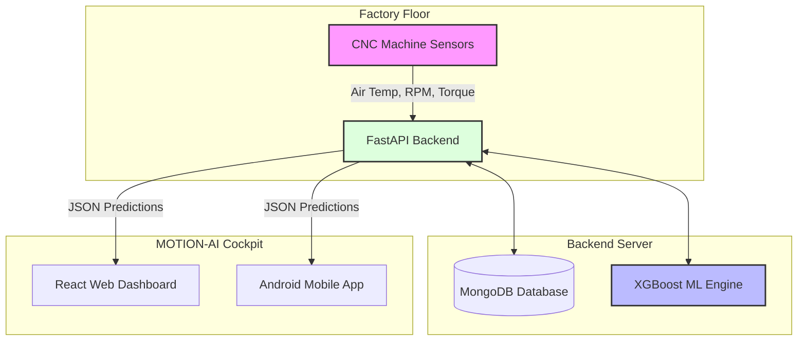

# Project Proposal: MOTION-AI

**Title:** Autonomous Predictive Intelligence Cockpit
**Team Size:** 2 Students

## 1. Problem Statement
In modern manufacturing, unplanned machine downtime (e.g., CNC machines, conveyor belts) leads to massive financial losses and production delays. Traditional maintenance strategies are purely reactive (fixing a machine after it breaks) or schedule-based (replacing parts too early). 
**MOTION-AI** solves this by providing a centralized "Cockpit" dashboard that uses live sensor telemetry to predict exactly when a machine will fail before it actually happens.

## 2. ML Task Type
The project utilizes a hybrid Machine Learning approach:
1. **Binary Classification:** Predicting the immediate probability of machine failure (Failure vs. No Failure) using **XGBoost** and **Random Forest**.
2. **Predictive Regression (Future Scope):** Estimating the Remaining Useful Life (RUL) of the equipment using LSTM neural networks.

## 3. Dataset
We are utilizing a **Predictive Maintenance Telemetry Dataset** (mirroring the AI4I 2020 industry standard). 
- **Size:** 10,000 recorded instances.
- **Features:** Air Temperature [K], Process Temperature [K], Rotational Speed [RPM], Torque [Nm], and Tool Wear [min].
- **Target Variable:** Binary Failure (0 or 1).

## 4. Evaluation Metrics
To evaluate the models, we prioritize metrics that penalize missed failures, as a missed failure results in machine breakdown.
* **Recall (Sensitivity):** The primary metric. We must minimize False Negatives (predicting a machine is healthy when it is actually failing).
* **F1-Score:** To maintain a balance between Precision and Recall.
* **Accuracy:** As a general baseline metric.

## 5. Tools & Technology Stack
* **Machine Learning:** Python, Scikit-Learn, XGBoost, Pandas, Seaborn (for EDA).
* **Backend API:** FastAPI (Python), MongoDB.
* **Frontend Dashboard:** React.js, Vite, Tailwind/CSS.
* **Mobile App:** Capacitor (Android APK deployment).

## 6. System Architecture Diagram

